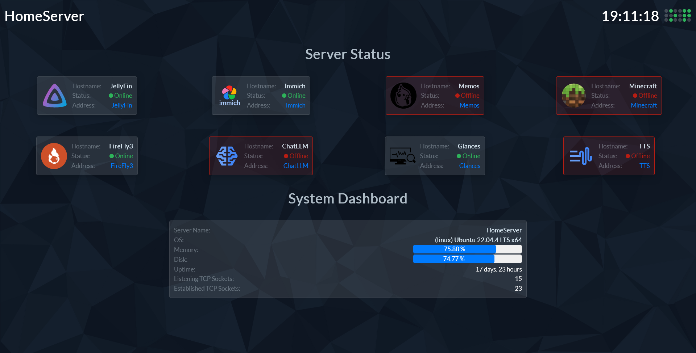
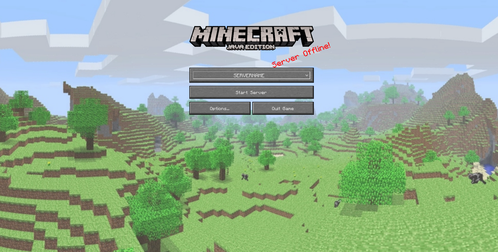

## Dashboard

Dashboard page for my HomeServer.

### Preview

#### Dashboard

</img>

#### Minecraft

</img>

### Features

1. Looks good (Subjective)
2. Shows a list of all the services running on the server with their status.
3. Shows the current CPU and Memory usage of the server using the nodejs `systeminformation` library.

### How to use - Easy Version

#### Docker (Coming soon)

#### Python Script:

1. Clone the repository.

2. Make sure you have [python](https://www.python.org/downloads/), [nodejs](https://nodejs.org/en/download/) and [npm](https://www.npmjs.com/get-npm) installed on your system.

3. Run the following command in the terminal:

```bash
python3 installer.py
```

### How to use - Hard Version

(Assuming you have nodejs and npm installed on your system)

1. Clone the repository.
2. Go to frontend folder and run `npm install` to install all the dependencies for the frontend.
3. Go to backend folder and install express and the following libraries using `npm install`:
   - `child_process` (To run shell commands)
   - `express` (To create the server)
   - `systeminformation` (To get the system information)
   - `fs` (To read the files)
4. Build the frontend using `npm run build` in the frontend folder. This will create a build folder in the frontend folder.
5. Similarly run `npm install` and build the minecraft view using `npm run build` in the minecraft folder.
6. Move all the files from the Backend folder to the root folder.
7. Run the following command in the terminal:

```bash
node server.js
```

8. Open the browser and go to `localhost:3000` to see the dashboard.

### How to add services

Go to `Frontend/src/data/services.json` and add the following code:

```json
{
  "Server": "Server Purpose",
  "Name": "Server Name",
  "Link": "Server Link",
  "Status": "Online"
}
```

To add images add them to the `Frontend/src/assets/icons` folder and make sure the Server's `name` matches the name of the file of the icon. Then go to `Frontend/src/scripts/icons.js` and add the following code:

```javascript
export { default as ServerName } from "../assets/icons/ServerName.svg";
```

### How to add minecraft servers

- Frontend:
  - Go to `Minecraft/script.js` and add the server name to the variable `servers`.

Thats all you need to do (I think).


I know, but it's a one-time thing.

### Credits

- Official applications for the icons.
- Google Fonts for the fonts.
- and to everything else that I might have missed.

### Contributing

Feel free to contribute to the project. If you have any suggestions or want to add a feature, feel free to open an issue or a pull request.
